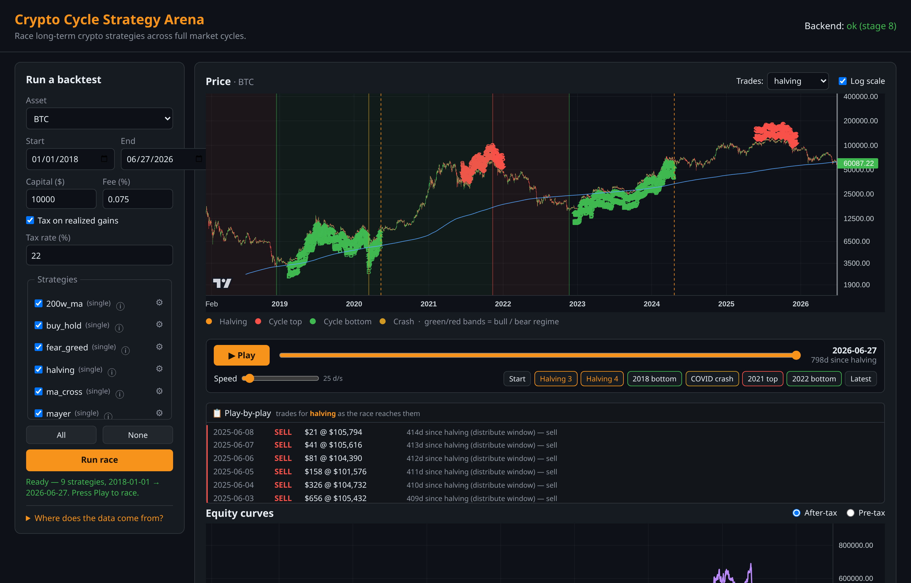

# Crypto Cycle Strategy Arena

A backtesting "game" that races long-term crypto trading strategies against each
other through real historical price data (BTC / ETH / BNB, daily), visualised as
a live race across full bull/bear cycles. You tune strategy parameters, watch
them compete, and discover **which strategy actually wins** — by a risk-adjusted,
after-tax, walk-forward-validated measure, not just raw return — then export the
winner's config as a clean JSON file for a future live-trading bot.

**Scope:** the game only — backtesting + visualisation. No live trading, no exchange
keys, no real money. Focus is long-term halving-cycle strategies, not day trading.



## What you get

- Race **9 built-in strategies** across 2018 → today and watch the leaderboard
  shuffle live as the cycles play out.
- See **exactly when each strategy bought and sold**, drawn onto the price chart as
  the race unfolds.
- A **winner** is picked by risk-adjusted, after-fee, after-tax performance — so a
  strategy that just got lucky in one bull run doesn't win by default.
- **Validate** that winner on data it never saw (walk-forward + different start
  dates), so you aren't fooled by curve-fitting.
- **Auto-tune** any strategy's settings, and **export** the winning setup as JSON.
- Every strategy explains, in plain English, **what it does and where its data comes
  from** — nothing is a black box.

> Curious how it's built or what's coming next? See the [roadmap & build log](ROADMAP.md).

## Quick start

If you already have [Docker](https://www.docker.com/), one command runs everything
(the image ships with a market-data database baked in):

```bash
docker run -p 8000:8000 ghcr.io/nexor666/crypto-arena
```

Then open **<http://localhost:8000>**. Press `Ctrl+C` to stop. Never used Docker
before? The step-by-step guide below walks you through it from scratch.

## Run (full guide)

**New to all this? Don't worry — this section assumes zero prior setup.** There are
two ways to run the app; pick one:

- **🟢 Option A — Just run it (easiest).** Download a ready-made package and start it
  with a single command. No code, no building, data already included. Best for
  trying it out.
- **🔧 Option B — Build it yourself from the source code.** Get the code and build
  the package on your own machine. Best if you want to read or change the code.

**Both options need Docker** — a free tool that runs the app in a self-contained box
so you don't have to install Python, databases, or anything else by hand. Install it
once (Step 1), then follow Option A *or* B.

### Step 1 — Install Docker (one-time)

**On Linux** (Ubuntu, Debian, Fedora, Mint, and most others) — open a terminal and
paste these three lines, one at a time:

```bash
curl -fsSL https://get.docker.com | sh      # installs Docker (asks for your password)
sudo usermod -aG docker $USER               # lets you run docker without sudo
newgrp docker                               # apply that now (or just log out and back in)
```

<details><summary>On Arch / Manjaro / CachyOS instead</summary>

```bash
sudo pacman -S docker                        # install
sudo systemctl enable --now docker           # start it now + on every boot
sudo usermod -aG docker $USER && newgrp docker
```
</details>

**On Windows or macOS:** download **Docker Desktop** from
<https://www.docker.com/products/docker-desktop/>, install it, and open it once so
it's running. Then use the same commands below in PowerShell (Windows) or Terminal
(macOS).

**Check it works** (should print "Hello from Docker!"):

```bash
docker run hello-world
```

> If that last command says "permission denied", you haven't applied the group
> change yet — close the terminal and open a new one (or just reboot), then retry.

### 🟢 Option A — Run the ready-made package (no code, no building)

The published image already contains the app **and** a market-data database, so this
one command downloads it and starts everything:

```bash
docker run -p 8000:8000 ghcr.io/nexor666/crypto-arena
```

The first run downloads the image (a minute or two); after that it's instant. When
it prints that it's running, open your web browser to **<http://localhost:8000>** —
that's the app. (Sanity check: <http://localhost:8000/api/health> should show
`{"status":"ok",...}`.) **To stop it**, press `Ctrl+C` in the terminal.

Your Hall of Fame starts empty and fills as you race strategies. By default those
results disappear when the container is removed; to **keep them** across restarts,
add a storage volume:

```bash
docker run -p 8000:8000 -v arena-data:/app/data ghcr.io/nexor666/crypto-arena
```

### 🔧 Option B — Build it yourself from source

You'll also need **git** (to download the code). Install it if you don't have it:
`sudo apt install git` (Ubuntu/Debian), `sudo pacman -S git` (Arch), or from
<https://git-scm.com> (Windows/macOS). Then:

```bash
git clone https://github.com/nexor666/crypto-arena.git
cd crypto-arena
docker compose up --build
```

That builds the image locally (the build automatically fetches a fresh data
snapshot — needs internet, takes a few minutes the first time) and serves it at
**<http://localhost:8000>**. Stop it with `Ctrl+C`. Your data and Hall of Fame live
in the `data/` folder next to the code, so they persist between runs.

<details><summary>Advanced — run from source without Docker (Python dev)</summary>

The data libraries live in `requirements.txt`; install them into a virtual env.
Call the venv's interpreter directly (works in bash, zsh and fish):

```bash
python -m venv venv
venv/bin/pip install -r requirements.txt
venv/bin/python -m backend.data.refresh        # populate the SQLite store first
venv/bin/uvicorn backend.main:app --reload --port 8000
```

Prefer to "activate" the venv first? `source venv/bin/activate` (bash/zsh) or
`source venv/bin/activate.fish` (fish) — then drop the `venv/bin/` prefixes.
</details>

### Updating the market data

The baked/seeded data is a snapshot from build time. To pull the latest prices,
indicators, Fear & Greed and MVRV (writes an immutable raw snapshot first, then
upserts), refresh in place — no rebuild needed:

```bash
# Running container (any of the above), or via the API:
curl -X POST localhost:8000/api/admin/refresh
docker exec crypto-arena python -m backend.data.refresh   # compose service name

# Local dev:
venv/bin/python -m backend.data.refresh            # full pull
venv/bin/python -m backend.data.refresh --status   # row counts + date ranges
```

> Refreshes persist only if `/app/data` is on a mounted volume (compose does this;
> for `docker run` add `-v arena-data:/app/data`). The published image is also
> rebuilt weekly, so a freshly pulled image already carries recent data.

## Using it

### The web UI

Open <http://localhost:8000>. The dates default to the full window (2018 → latest),
so just tick the strategies, optionally open **ⓘ** (read what a strategy does) or
**⚙** (tune its parameters), and hit **Run race**. The race **starts at the starting
line** — everyone tied, the charts blank — so pressing **Play** is a *reveal*, not a
replay. You can scrub, change speed, jump to events (halvings, cycle tops/bottoms),
overlay any strategy's buy/sell markers, declare and **validate** the winner,
**auto-tune** a strategy, and watch the persistent **Hall of Fame** grow across
sessions. (Full feature walkthrough: [ROADMAP.md](ROADMAP.md).)

### From the command line

One command races **all** strategies over a window and prints a leaderboard
(after-tax, ranked by `standardized_score`):

```bash
python -m backend.engine.run --asset BTC --start 2018-01-01
python -m backend.engine.run --asset ETH --sort cagr --verbose
python -m backend.engine.run --golden     # Buy & Hold (fee=0) == raw price return
```

### HTTP API

| Route | Purpose |
|-------|---------|
| `GET /api/health` | Liveness + current stage |
| `GET /api/data/status` | Store row counts + date ranges |
| `GET /api/price-data/{asset}` | OHLCV + indicators for one asset |
| `GET /api/strategies` | Strategy registry + each one's parameter schema + plain-English info block (thesis, rule, level/edge/scheduled, inputs) |
| `GET /api/events` | Halving dates + notable cycle tops/bottoms |
| `GET /api/data-sources` | Data provenance (provider + scope) merged with live coverage windows |
| `POST /api/backtest` | Race selected strategies → full per-day equity + trades + metrics + leaderboard (and append each to the runs ledger) |
| `GET /api/hall-of-fame` | Persistent ledger ranked for one settings signature (best score, configs, times-tried, best-over-time) |
| `POST /api/walk-forward` | Walk-forward validate one strategy: tune in-sample → score out-of-sample, roll forward |
| `POST /api/robustness` | Re-run one fixed config from several start dates → how often it beats Buy & Hold |
| `POST /api/auto-tune` | Grid-search one strategy's params scored out-of-sample → best params + a beats-the-defaults-on-a-hold-out verdict |

```bash
# Race every strategy on BTC from 2018 (empty "strategies" = all):
curl -s -X POST localhost:8000/api/backtest \
  -H 'Content-Type: application/json' \
  -d '{"asset":"BTC","start":"2018-01-01","capital":10000}'

# Auto-tune one strategy's params out-of-sample (returns tuned params + a hold-out verdict):
curl -s -X POST localhost:8000/api/auto-tune \
  -H 'Content-Type: application/json' \
  -d '{"asset":"BTC","start":"2018-01-01","strategy":"mayer","n_folds":3}'
```

### Tests

```bash
python -m pytest tests/ -q
```

## Tech stack

- **Backend:** Python 3.12 + FastAPI (serves the JSON API and the static frontend)
- **Data/cache:** SQLite (prices, indicators, Fear & Greed, MVRV)
- **Engine:** custom, pandas-backed daily loop with strict no-look-ahead
- **Frontend:** plain HTML/CSS/vanilla JS + TradingView Lightweight Charts
- **Container:** Docker / docker-compose, single image, one port

## Project structure

```
crypto-arena/
  docker-compose.yml
  Dockerfile               # bakes a fresh seed DB into the image at build time
  docker-entrypoint.sh     # seeds /app/data on first boot (else live fetch)
  .github/workflows/       # CI: build + publish the image to GHCR (weekly rebuild)
  requirements.txt
  data/              # SQLite db + raw cache (mounted volume, gitignored)
  backend/
    main.py          # FastAPI app + routes + static mount
    data/            # fetchers, indicators, sqlite store + runs ledger
    engine/          # portfolio, tax, backtest loop, metrics, ledger, validation
    strategies/      # strategy plugins + registry
  frontend/          # UI: index.html, app.js, charts.js, playback.js, arena_extras.js, styles.css
```
